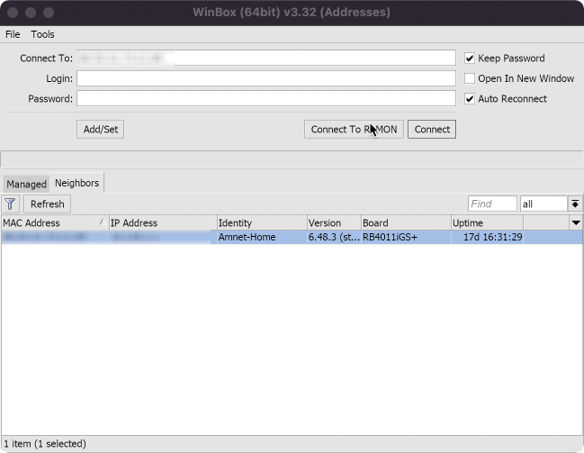
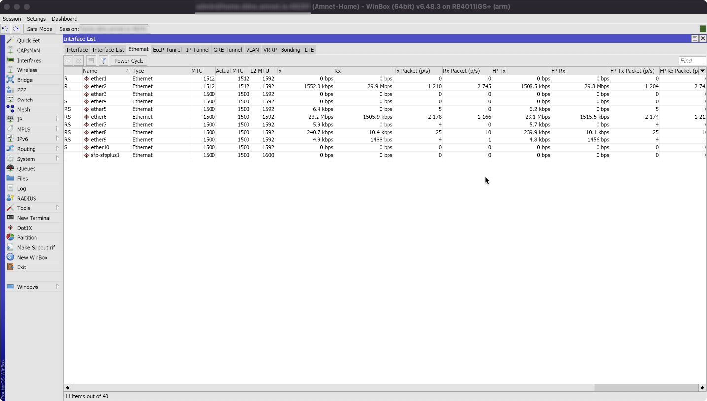

# Winbox For Mac (M1)

### Step 1 install wine
```bash
brew tap gcenx/wine && brew install --cask --no-quarantine wine-crossover
```
### Step 2 run winecfg for init user.reg and close winecfg
```bash
winecfg
```
### Step 3 edit user.reg to change color in wine (fix brown backgroung)
```bash
nano ~/.wine/user.reg
```
`find`
```
[Control Panel\\Colors]
...
```
`edit to`
```
[Control Panel\\Colors] 1618070712
#time=1d72aafca284880
"ActiveBorder"="228 228 228"
"ButtonFace"="228 228 228"
"ButtonLight"="228 228 228"
"InactiveBorder"="228 228 228"
"Menu"="228 228 228"
```
`save (Ctrl + X)`

### Step 4 config wine support retina resolution
```bash
nano ~/.wine/user.reg
```
`add this to end of file`
```
[Software\\Wine\\Mac Driver] 1617691255
"RetinaMode"="y"
```
`save (Ctrl + X)`

### Step 5 set dpi to 196
```bash
winecfg
```
`go to Graphics and set Screen resolution to 196`

### Step 6 download winbox and run with wine
```
https://mt.lv/winbox64
```
```
cd Downloads && wine winbox64
```

### Step 7 for ZSH
```bash
mkdir .Applications && cd .Applications
```
```bash
wget https://mt.lv/winbox64
```
```bash
alias winbox="nohup wine64 ~/.Applications/winbox64  > /dev/null  &" >> ~/.zshrc
```
```bash
source ~/.zshrc
```
```
winbox
```

### Images


